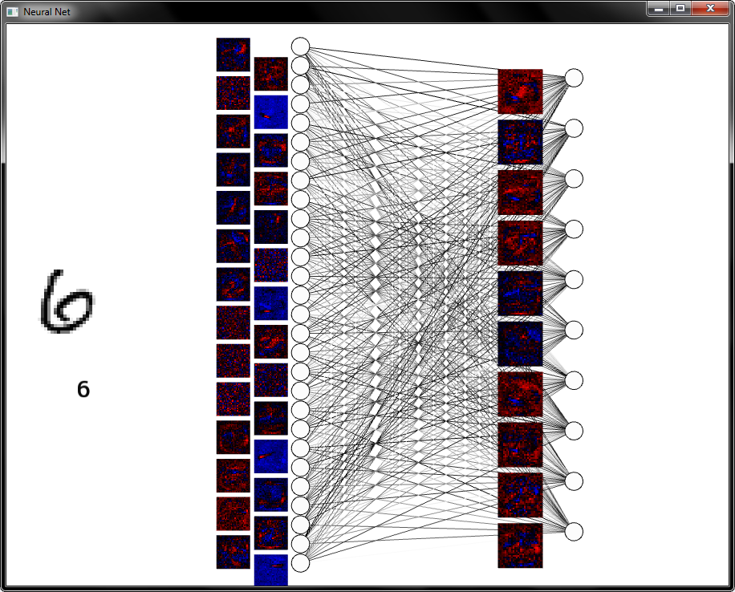

# NeuralNetworks
My playground for experimenting with neural networks and machine learning.

I've been building this while following along with Michael Nielsen's excellent book [Neural Networks and Deep Learning](http://neuralnetworksanddeeplearning.com/)

The code currently builds and trains a neural network on MNIST data, learning to recognize handwritten digits in images.

I've got it hooked up to some basic graphical visualization using SFML:

The initial commit of the codebase is around 2 weeks worth of work. It's still a work in progress.

I plan on adding dropout, regularization, and image convolution, and eventually plan to use this code as a basis to learn OpenCL.

